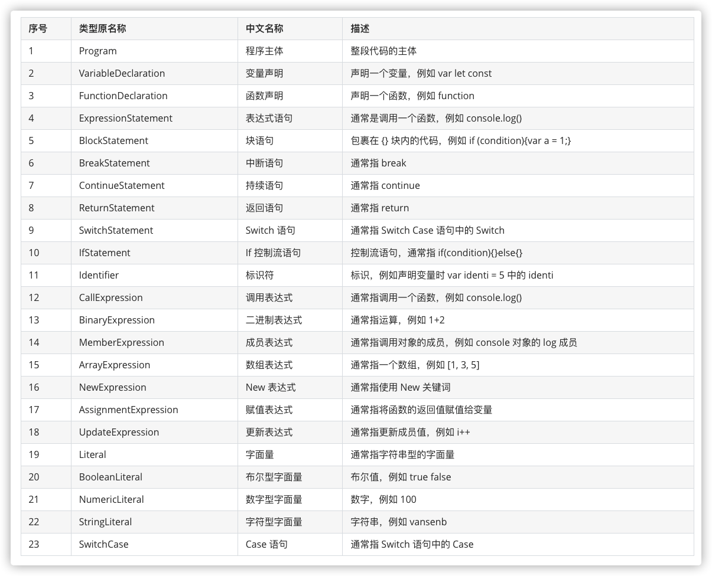
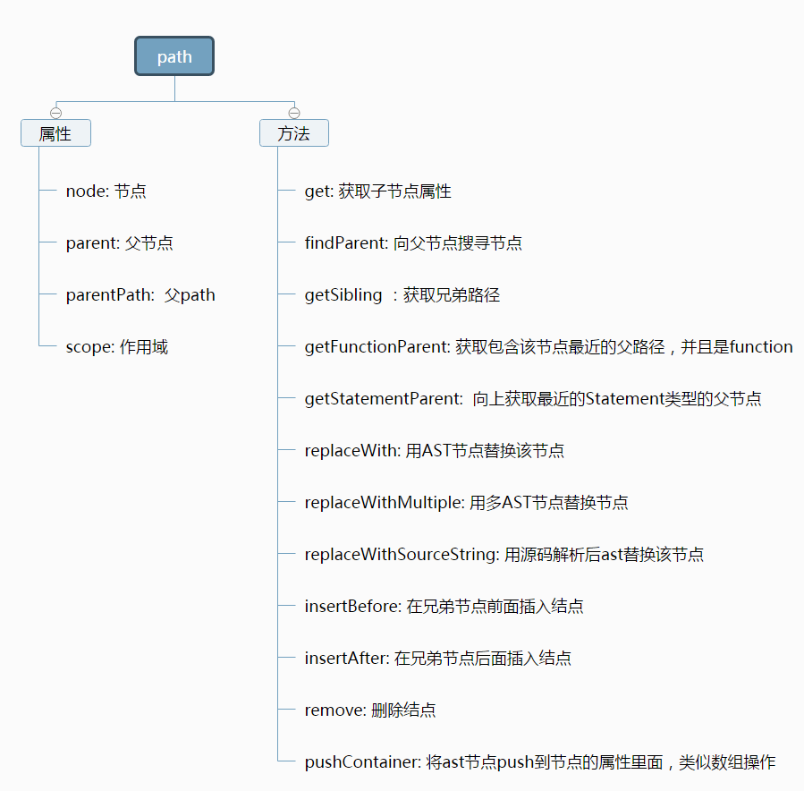

[TOC]

内容整理自蔡老板的知识星球
===

# 拓展
[JavaScript 教程](https://wangdoc.com/javascript/index.html)

[ES6 入门教程](https://es6.ruanyifeng.com/)

[百度在线字体编辑器](http://fontstore.baidu.com/static/editor/index.html)

[奇Q在线字体编辑器](https://font.qqe2.com/)

[fonttools](https://github.com/fonttools/fonttools)

[AST在线解析网站](https://astexplorer.net/)

[babel库 GitHub](https://github.com/babel/babel)

[babel库 docs](https://babeljs.io/docs/en/babel-parser)

[Babel插件开发手册](https://blog.csdn.net/weixin_33826609/article/details/93164633#toc-visitors)

[AST入门网站](https://github.com/yacan8/blog/blob/master/posts/JavaScript%E6%8A%BD%E8%B1%A1%E8%AF%AD%E6%B3%95%E6%A0%91AST.md)

[查看JavaScript代码流程](https://bogdan-lyashenko.github.io/js-code-to-svg-flowchart/docs/live-editor/index.html)

[GitHub地址](https://github.com/Bogdan-Lyashenko/js-code-to-svg-flowchart)

[https://github.com/babel/babylon/blob/master/ast/spec.md](https://github.com/babel/babylon/blob/master/ast/spec.md)
[http://www.alloyteam.com/2017/04/analysis-of-babel-babel-overview/](http://www.alloyteam.com/2017/04/analysis-of-babel-babel-overview/)

[https://fed.taobao.org/blog/taofed/do71ct/babel-plugins/](https://fed.taobao.org/blog/taofed/do71ct/babel-plugins/)
[http://www.alloyteam.com/2016/05/babel-code-into-a-bird-like/](http://www.alloyteam.com/2016/05/babel-code-into-a-bird-like/)

[生成漂亮图片代码的网站](https://carbon.now.sh/)


# 安装
node 

[https://nodejs.org/zh-cn/](https://nodejs.org/zh-cn/)

babel
```
npm install @babel/core
```


# 节点含义


# 节点属性及方法


# enter(默认)与 exit 的区别
与%20exit%20的区别.png)

# 节点的一些方法
## 查看源代码
```
path.toString()
```

## 节点构造
使用 `t.valueToNode` 方法代替 `t.NumericLiteral`、`t.StringLiteral` 等一些构造 `Literal` 方法:
用法如下:

```js
t.valueToNode(123);
t.valueToNode("123");
t.valueToNode(null);
```

回一个node类型的节点，这样就省去了判断 Literal 节点的类型。

## 节点替换
使用 `path.replaceInline` 方法代替 `path.replaceWith`、`path.replaceWithMultiple` 方法:
源代码如下:

```js
function replaceInline(nodes) {
  this.resync();

  if (Array.isArray(nodes)) {
  	console.log(this.container.type);
    if (Array.isArray(this.container)) {
    	
      nodes = this._verifyNodeList(nodes);

      const paths = this._containerInsertAfter(nodes);

      this.remove();
      return paths;
    } else {
      return this.replaceWithMultiple(nodes);
    }
  } else {
    return this.replaceWith(nodes);
  }
}
```
整合了两种方法

## 强大的path.evaluate
强大的path.evaluate方法,调用返回一个object:
```js
{
  confident: state.confident,
  deopt: state.deoptPath,
  value: value
}
```

将一些表达式直接计算出结果来，比如 1+2 遍历 `BinaryExpression`，返回 `object` 中的value为3;
也可以将表达式 `'1|3|5|7|2|4|6'.split('|')`, 遍历 `CallExpression`，返回 `object` 中的 value 为 `["1", "3", "5", "7", "2", "4", "6"]`;

源代码

```js
function evaluate() {
  const state = {
    confident: true,
    deoptPath: null,
    seen: new Map()
  };
  let value = evaluateCached(this, state);
  if (!state.confident) value = undefined;
  return {
    confident: state.confident,
    deopt: state.deoptPath,
    value: value
  };
}
```
通过返回的 `confident` 判断 value是否有效。

```js
const {confident,value} = path.evaluate();
confident && path.replaceInline(t.valueToNode(value));
```

可遍历的节点类型:
```
SequenceExpression
StringLiteral
NumericLiteral
BooleanLiteral
NullLiteral
TemplateLiteral
TaggedTemplateExpression
ConditionalExpression
ExpressionWrapper
MemberExpression
UnaryExpression
ArrayExpression
ObjectExpression
LogicalExpression
BinaryExpression
CallExpression
```

修改源代码使之能够处理更多的节点类型(路径:node_modules\@babel\traverse\lib\path\evaluation.js)：

```js
const VALID_CALLEES = ["String", "Number", "Math"];
```

比如在后面加一个 parseInt 也可以帮你进行计算。
```js
const VALID_CALLEES = ["String", "Number", "Math","parseInt"];
```

再遍历 `CallExpression`，如果callee 为 parseInt时，也可以直接计算出结果。

### 兼容处理 "string"["length"]结构
我们在调用 path.evaluate 方法时，它只处理了"string".length这种方式的表达式试，
而 "string"["length"]  是无法直接进行处理的，
我们可以把 "string"["length"]  这种方式的表达式转换为 "string".length这种方式，
仓库里面有转换的插件，下面介绍一种一劳永逸的办法。

1. 打开node_modules\@babel\traverse\lib\path\evaluation.js 文件
2. 找到 _evaluate  函数，查看对 MemberExpression 表达式的处理:

```js
 if (path.isMemberExpression() && !path.parentPath.isCallExpression({
    callee: node
  })) {
    const property = path.get("property");
    const object = path.get("object");
    if (object.isLiteral() && property.isIdentifier()) {
      const value = object.node.value;
      const type = typeof value;
      if (type === "number" || type === "string") {
        return value[property.node.name];
      }
    }
  }
```

它主要处理在第二个 if 语句里面。
但是它只考虑了 object是字面量且property必须是 Idernifier 的情况，也就是类似 "string".length的表达式。
现在把这种情况增加进去即可,代码如下:
```js
else if (object.isLiteral() && property.isLiteral()) {
      const value = object.node.value;
      const type = typeof value;
      if (type === "number" || type === "string") {
        return value[property.node.value];
      }
    }  
```

至于其它的类型，找到对应的源代码进行修改即可

## 节点的插入
在当前节点前插入:
```js
path.insertBefore(nodes);
```

在当前节点后插入:
```js
path.insertAfter(nodes);
```

在所有同级节点前插入:
```js
path.container.unshift(nodes);
```

在所有同级节点后插入:
```js
path.container.push(nodes);
```

插入操作时，一定要注意 需要遍历的节点